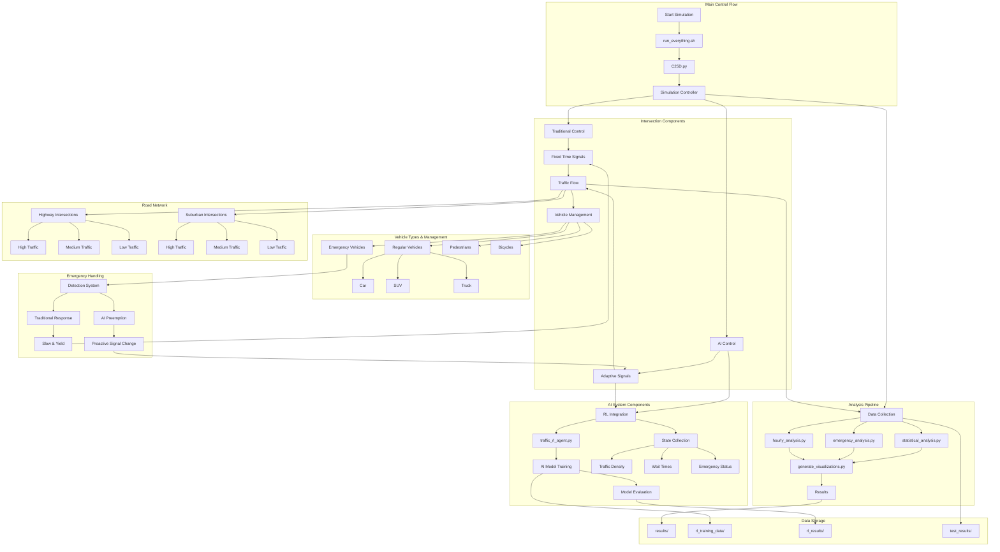

# AI Traffic Control System Simulation

This repository contains the code and data used for the simulation used in the reseach paper that was written by for Vienna International Science and Engineering Fair, evaluating the effectiveness of AI-controlled traffic light systems compared to the traditional counterparts. 

## Features

- **Dual System Simulation**: Models both traditional fixed-time and AI-driven adaptive traffic control systems
- **Realistic Traffic Patterns**: 
  - Various road types (suburban, highway) and congestion levels (low, medium, high)
  - Time-of-day traffic variations with peak/off-peak hours
  - Day-to-day variability for realistic modeling
- **Emergency Vehicle Handling**: Implements preemptive signal control in AI mode
- **Comprehensive Metrics**: 
  - Vehicle wait times (overall and by hour)
  - Emergency vehicle response times
  - Fuel consumption and efficiency
  - CO₂ emissions and environmental impact
- **Statistical Analysis**: Detailed statistical comparisons including effect sizes and significance tests
- **Data Visualization**: Generates charts and graphs for all key metrics
- **Reinforcement Learning**: Deep Q-Network (DQN) based traffic light control using PyTorch


## System Architecture

The following flowchart illustrates the main components and data flow of the simulation system:



## Key Findings

- **Wait Time Reduction**: AI systems reduced average vehicle wait times by 73.4%
- **Emergency Response**: Emergency vehicle wait times decreased by 62.0%
- **Fuel Efficiency**: Fuel consumption per vehicle reduced by 41.3%
- **Environmental Impact**: CO₂ emissions reduced by 59.2%
- **Emergency Vehicle Preemption**: AI systems detected and preemptively responded to 59.8% of emergency vehicles

## Requirements

- Python 3.7+
- NumPy
- Pandas
- Matplotlib
- Seaborn
- SciPy
- tqdm
- PyTorch

## Project Structure

```
C25D/
├── C25D.py                   # Main simulation script
├── traffic_rl_agent.py       # DQN agent implementation
├── rl_integration.py         # Integration of RL with simulation
├── train_rl_model.py         # Script to train and evaluate RL model
├── hourly_analysis.py        # Hourly patterns analysis
├── emergency_analysis.py     # Emergency vehicle analysis
├── statistical_analysis.py   # Statistical significance testing
├── calculate_effect_sizes.py # Effect size calculations
├── generate_visualizations.py # Data visualization generator
├── run_full_analysis.sh      # Complete analysis pipeline
├── run_silent_analysis.sh    # Analysis with warnings suppressed
├── run_silent_analysis_with_vis.sh # Analysis with visualizations
├── results/                  # Simulation results and visualizations
├── rl_results/               # Reinforcement learning results
└── LICENSE                   # MIT License
```

## Usage Instructions

### Running Everything

```bash
# Run the main simulation
./run_everything.sh
```

### Running the Main Simulation

```bash
# Run the main simulation
python C25D.py
```

### Running Reinforcement Learning

```bash
# Train and evaluate the RL model (with default parameters)
./train_rl_model.py

# Train only
./train_rl_model.py --mode train --n_intersections 5 --n_days 30 --n_episodes 10

# Evaluate only
./train_rl_model.py --mode evaluate --n_intersections 10 --n_days 7

# Use GPU acceleration if available
./train_rl_model.py --cuda
```

### Running Analysis Tools

```bash
# Full analysis with detailed output
./run_full_analysis.sh

# Analysis with warnings suppressed
./run_silent_analysis.sh

# Analysis with warnings suppressed and visualization generation
./run_silent_analysis_with_vis.sh
```

### Individual Analysis Scripts

```bash
# Analyze hourly patterns in wait times and other metrics
python hourly_analysis.py

# Analyze emergency vehicle data and preemption effects
python emergency_analysis.py

# Calculate statistical significance of improvements
python statistical_analysis.py

# Calculate effect sizes for various metrics
python calculate_effect_sizes.py

# Generate all visualizations with descriptive filenames
python generate_visualizations.py
```

### Viewing Results

The simulation results are stored in timestamped directories under `results/`, with each simulation run generating:

- CSV data files with raw simulation data
- Visualization images for key metrics
- Summary reports in markdown format

## License

We would like to acknowledge the use of Cursor (Anysphere Inc., 2025) for its assistance in developing and debugging the code for the simulation.

## License

[MIT License](LICENSE)