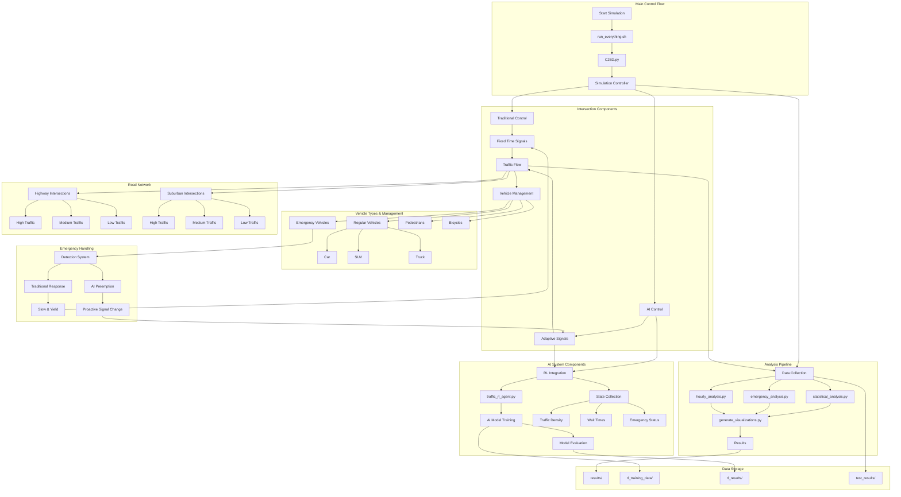

# AI Traffic Control System Simulation

A comprehensive simulation framework comparing traditional fixed-time traffic light systems with AI-driven adaptive systems across multiple intersections and time periods. This project demonstrates significant improvements in traffic efficiency, emergency response times, and environmental metrics through AI-based traffic management.

## Features

- **Dual System Simulation**: Models both traditional fixed-time and AI-driven adaptive traffic control systems
- **Realistic Traffic Patterns**: 
  - Various road types (suburban, highway) and congestion levels (low, medium, high)
  - Time-of-day traffic variations with peak/off-peak hours
  - Day-to-day variability for realistic modeling
- **Emergency Vehicle Handling**: Implements preemptive signal control in AI mode
- **Comprehensive Metrics**: 
  - Vehicle wait times (overall and by hour)
  - Emergency vehicle response times
  - Fuel consumption and efficiency
  - CO₂ emissions and environmental impact
- **Statistical Analysis**: Detailed statistical comparisons including effect sizes and significance tests
- **Data Visualization**: Generates charts and graphs for all key metrics
- **Reinforcement Learning**: Deep Q-Network (DQN) based traffic light control using PyTorch

## System Architecture

The following flowchart illustrates the main components and data flow of the simulation system:



The flowchart shows the major components of the system and how they interact:
- Main control flow starts with the shell script and coordinates the simulation
- Intersection components handle both traditional and AI-based traffic control
- Vehicle management system handles different types of vehicles and their behaviors
- AI system components show the reinforcement learning integration
- Analysis pipeline processes the simulation data and generates visualizations
- Road network shows the different types of intersections and traffic conditions
- Emergency handling shows how both systems respond to emergency vehicles
- Data storage shows where different types of results are stored

## Key Findings

- **Wait Time Reduction**: AI systems reduced average vehicle wait times by 73.4%
- **Emergency Response**: Emergency vehicle wait times decreased by 62.0%
- **Fuel Efficiency**: Fuel consumption per vehicle reduced by 41.3%
- **Environmental Impact**: CO₂ emissions reduced by 59.2%
- **Emergency Vehicle Preemption**: AI systems detected and preemptively responded to 59.8% of emergency vehicles

## Requirements

- Python 3.7+
- NumPy
- Pandas
- Matplotlib
- Seaborn
- SciPy
- tqdm
- PyTorch (for reinforcement learning)

## Project Structure

```
C25D/
├── C25D.py                   # Main simulation script
├── traffic_rl_agent.py       # DQN agent implementation
├── rl_integration.py         # Integration of RL with simulation
├── train_rl_model.py         # Script to train and evaluate RL model
├── hourly_analysis.py        # Hourly patterns analysis
├── emergency_analysis.py     # Emergency vehicle analysis
├── statistical_analysis.py   # Statistical significance testing
├── calculate_effect_sizes.py # Effect size calculations
├── generate_visualizations.py # Data visualization generator
├── run_full_analysis.sh      # Complete analysis pipeline
├── run_silent_analysis.sh    # Analysis with warnings suppressed
├── run_silent_analysis_with_vis.sh # Analysis with visualizations
├── results/                  # Simulation results and visualizations
├── rl_results/               # Reinforcement learning results
└── LICENSE                   # MIT License
```

## Usage Instructions

### Running the Main Simulation

```bash
# Run the main simulation
python C25D.py
```

### Running Reinforcement Learning

```bash
# Train and evaluate the RL model (with default parameters)
./train_rl_model.py

# Train only
./train_rl_model.py --mode train --n_intersections 5 --n_days 30 --n_episodes 10

# Evaluate only
./train_rl_model.py --mode evaluate --n_intersections 10 --n_days 7

# Use GPU acceleration if available
./train_rl_model.py --cuda
```

### Running Analysis Tools

```bash
# Full analysis with detailed output
./run_full_analysis.sh

# Analysis with warnings suppressed
./run_silent_analysis.sh

# Analysis with warnings suppressed and visualization generation
./run_silent_analysis_with_vis.sh
```

### Individual Analysis Scripts

```bash
# Analyze hourly patterns in wait times and other metrics
python hourly_analysis.py

# Analyze emergency vehicle data and preemption effects
python emergency_analysis.py

# Calculate statistical significance of improvements
python statistical_analysis.py

# Calculate effect sizes for various metrics
python calculate_effect_sizes.py

# Generate all visualizations with descriptive filenames
python generate_visualizations.py
```

### Viewing Results

The simulation results are stored in timestamped directories under `results/`, with each simulation run generating:

- CSV data files with raw simulation data
- Visualization images for key metrics
- Summary reports in markdown format

Reinforcement learning results are stored in timestamped directories under `rl_results/`, including:

- Training statistics and plots
- Evaluation metrics
- Comparison reports
- Model checkpoints

## Reinforcement Learning Implementation

The project implements deep reinforcement learning (RL) for traffic control, offering a more advanced approach than rule-based systems:

### DQN Architecture

- **State Space**: Traffic conditions, vehicle counts, waiting times, time of day, and emergency vehicles
- **Action Space**: Green light durations (discrete choices)
- **Reward Function**: Combination of wait time reduction, emergency vehicle prioritization, and efficiency metrics
- **Network Architecture**: Dueling DQN with prioritized experience replay

### RL Training Process

1. **Data Collection**: The simulation environment provides state transitions, actions, and rewards
2. **Experience Replay**: Stores and randomly samples past experiences to break correlation
3. **Dueling Networks**: Separates state value and action advantage estimation
4. **Target Network**: Stabilizes training by providing fixed Q-targets

### Benefits of RL Approach

- **Adaptability**: Learns optimal strategies for different traffic patterns
- **Generalization**: Performs well across different intersection types and traffic conditions
- **Online Learning**: Can continue improving with more interaction data
- **Complex Decision Making**: Balances multiple objectives (wait times, emergency vehicles, fuel efficiency)

## How to Extend

The simulation can be extended by:

1. Modifying `C25D.py` to adjust traffic parameters or add new metrics
2. Creating additional analysis scripts to examine specific aspects
3. Enhancing visualization options in `generate_visualizations.py`
4. Extending the RL model in `traffic_rl_agent.py` with new algorithms

## License

[MIT License](LICENSE)