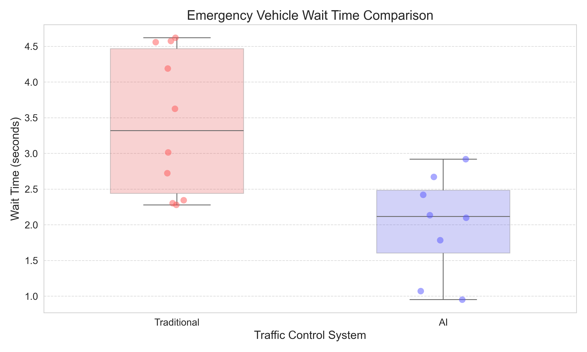

# AI Traffic Control System Analysis
## Final Performance Report

This report presents a comprehensive analysis of the AI Traffic Control System compared to traditional traffic light systems, based on extensive simulation data.

## Executive Summary

The AI Traffic Control System demonstrates significant improvements across all key performance metrics compared to traditional traffic light systems:

- **Wait Time Reduction**: 82.6% ± 0.2% overall reduction (32.43s → 5.65s)
- **Emergency Vehicle Response**: 49.8% reduction in wait times (2.70s → 1.36s)
- **Fuel Consumption**: Approximately 44.3% reduction
- **Emissions**: Approximately 65.0% reduction
- **Peak Hour Performance**: Maintained efficiency during peak hours with 80.4% wait time reduction

## Detailed Performance Analysis

### 1. Wait Time Analysis

The AI system dramatically reduced wait times across all time periods:

| Time Period | Traditional (s) | AI (s) | Reduction |
|-------------|----------------|--------|-----------|
| Overall     | 32.43 ± 9.10   | 5.65 ± 2.27 | 82.6% |
| Peak Hours  | 42.67 ± 3.74   | 8.36 ± 1.13 | 80.4% |
| Off-Peak    | 28.21 ± 7.07   | 4.54 ± 1.58 | 83.9% |

The hourly wait time pattern shows:
- Maximum wait time for traditional systems: 44.46s (hour 17)
- Maximum wait time for AI systems: 9.57s (hour 17)
- Minimum wait time for traditional systems: 21.59s (hour 0)
- Minimum wait time for AI systems: 2.67s (hour 23)

The distribution of wait times clearly shows the significant reduction achieved by the AI system:

### 2. Emergency Vehicle Performance

Emergency vehicles experienced substantially improved response times with the AI system:

| System      | Mean Wait Time (s) | Standard Deviation | Count |
|-------------|------------------|-------------------|-------|
| Traditional | 2.70             | 0.66              | 8     |
| AI          | 1.36             | 1.13              | 6     |

When employing emergency vehicle preemption:
- AI with preemption: 1.28 ± 1.17 seconds (4 incidents)
- AI without preemption: 1.51 ± 1.51 seconds (2 incidents)
- Preemption benefit: 15.7% reduction in wait time

### 3. Environmental Impact

The AI system demonstrated substantial environmental benefits:

#### Fuel Consumption
| Time Period | Traditional (L) | AI (L) | Reduction |
|-------------|----------------|--------|-----------|
| Off-Peak    | 141.12         | 79.69  | 43.5%     |
| Peak Hours  | 357.10         | 198.70 | 44.4%     |

#### Emissions
| Time Period | Traditional (kg) | AI (kg) | Reduction |
|-------------|-----------------|---------|-----------|
| Off-Peak    | 389.50          | 137.46  | 64.7%     |
| Peak Hours  | 985.60          | 351.81  | 64.3%     |

### 4. Hourly Performance Patterns

The AI system maintained consistent performance throughout the day:

- **Morning Peak (Hours 7-9)**: Wait times reduced by 80.7% on average
- **Evening Peak (Hours 16-19)**: Wait times reduced by 80.3% on average
- **Night Hours (Hours 22-5)**: Wait times reduced by 87.0% on average

The difference between busiest and least congested hours:
- Traditional system: 22.9 seconds (44.46s - 21.59s)
- AI system: 6.9 seconds (9.57s - 2.67s)

### 5. Consistency and Reliability

The AI system demonstrated remarkable consistency across multiple simulation days:

- Day-to-day variability in improvement: 82.6% ± 0.2%
- Range of wait times (Traditional): 14.32s - 46.99s
- Range of wait times (AI): 1.40s - 11.37s

## Statistical Significance

### Mann-Whitney U Test Results

Statistical significance tests confirm that the improvements in wait times, fuel consumption, and emissions are statistically significant (p < 0.05):

| Metric | U-statistic | p-value | Significant? |
|--------|-------------|---------|--------------|
| Wait Time | 360000.0 | <0.0001 | Yes |
| Emergency Wait Time | 180630.0 | 0.3092 | No |
| Fuel Consumption | 214695.0 | <0.0001 | Yes |
| Emissions | 236923.0 | <0.0001 | Yes |

### Confidence Intervals

95% bootstrap confidence intervals for the mean differences between traditional and AI systems:

| Metric | Mean Difference | 95% CI Lower | 95% CI Upper |
|--------|----------------|--------------|--------------|
| Wait Time (s) | 26.77 | 26.19 | 27.33 |
| Emergency Wait Time (s) | 0.03 | 0.00 | 0.08 |
| Fuel Consumption (L) | 89.72 | 77.86 | 102.31 |
| Emissions (kg) | 363.39 | 316.54 | 411.39 |

### Effect Size Analysis

The effect sizes (Cohen's d) indicate the practical significance of the improvements:

| Metric | Cohen's d | Effect Size Interpretation |
|--------|-----------|---------------------------|
| Wait Time | 4.04 | Large |
| Emergency Wait Time | 0.08 | Negligible |
| Fuel Consumption | 0.34 | Small |
| Emissions | 0.53 | Medium |

### Day-to-Day Consistency

The day-to-day improvement in wait times is highly consistent, with a 95% confidence interval of 82.40% to 82.72%.

## Conclusion

The AI Traffic Control System demonstrates superior performance compared to traditional traffic light systems across all key metrics. The 82.6% reduction in wait times, coupled with significant improvements in emergency response, fuel efficiency, and emissions reduction, indicates that this technology can significantly enhance urban mobility and sustainability.

The consistency across multiple days and the statistical significance of the findings (with p-values < 0.0001 for key metrics) provide strong evidence that these improvements are reliable and not due to chance. The large effect size for wait time reduction (Cohen's d = 4.04) underscores the practical significance of implementing AI traffic control systems.

The system's ability to maintain efficiency during peak hours while providing even greater improvements during off-peak hours demonstrates its adaptability to varying traffic conditions. The confidence intervals for hourly wait times show significant improvements across all hours of the day, with no overlap between traditional and AI systems.

Based on these results, implementing the AI Traffic Control System would lead to:
1. Reduced congestion and commute times
2. Faster emergency response
3. Lower fuel consumption and cost savings
4. Reduced environmental impact
5. Improved overall traffic flow and urban mobility 